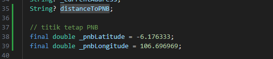
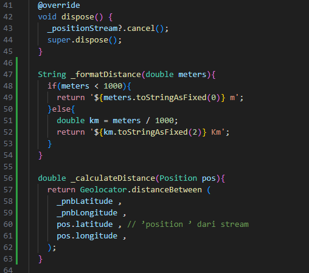
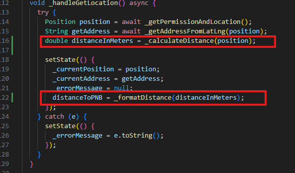
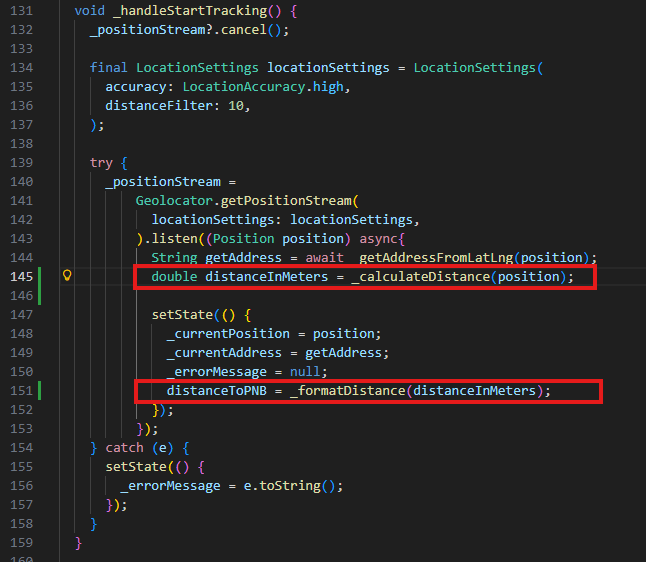
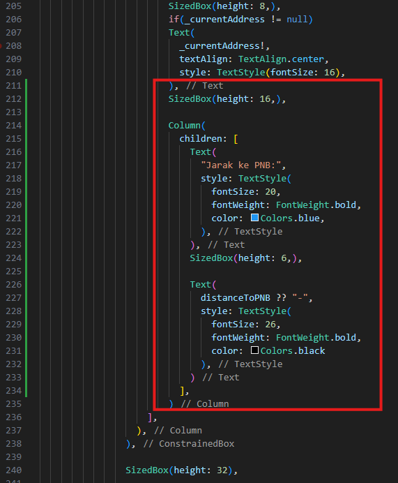

# project GPS

## Potongan Kode yang ditambahkan
#### Menambahkan variabel distanceToPNB dengan tipe data String dan menambahkan 2 variable lagi yang berisi posisi Tetap yang digunakan untuk membuat jarak dengan kita saat ini

#### Membuat fungsi _formatDistance dengan return value String yang berfungsi untuk membuat format menjadi km jika jaraknya lebih dari 1000 meter dan fungsi _calculateDistance dengan return value double yang berfungsi untuk menghitung jarak saat ini dengan jarak 2 variable yang telah dibuat diatas

#### Menambahkan variabel distanceInMeters dengan tipe data double untuk menyimpan jarak yang telah di hitung di dalam fungsi _calculateDistance dan menambahkan variable distanceToPNB didalam setstate untuk menampilkan jarak secara realtime. Dan semua itu ditambahkan di dalam fungsi _handleGetLocation

#### Penambahan pada fungsi _handleStartTracking sama dengan fungsi sebelumnya yaitu _handleGetLocation dan memiliki tugas yang sama.

#### Menambahkan hasil dari perhitungan dan konversi meter ke KM ke dalam UI di flutter

## Hasil Akhir

